# فيرو · Veyro: تحليل الأسهم الأمريكية والسعودية بـ TradingAgents

**US and Saudi (Tadawul) stock analysis, in Arabic and English, built on TradingAgents**

**Veyro is a bilingual (Arabic / English) desktop app for [TradingAgents](https://github.com/TauricResearch/TradingAgents)**, the open-source multi-agent LLM trading framework by Tauric Research. It turns a TradingAgents run (analysts, a bull-vs-bear debate, a trader, a risk team and a portfolio manager) into a pixel-art office of 8 animal characters you can watch, for **both US stocks (NYSE / NASDAQ) and Saudi stocks (Tadawul)**.

مكتب بكسلي فيه ٨ شخصيات حيوانات تتناقش حول سهم أمريكي أو سعودي قدامك، وبعدين ليو (الأسد) يعلن القرار. التطبيق **مبني على [TradingAgents](https://github.com/TauricResearch/TradingAgents)** من Tauric Research (Apache-2.0)، ويستخدمه كما هو بدون تعديل (نسخة v0.5.1)، ويضيف فوقه الواجهة والمنطق المالي وسقف الصرف والفحص الشرعي الاختياري.

> تحليل للمساعدة على التفكير، **وليس نصيحة مالية**. Analysis to help you think, **not financial advice**.
> Veyro is an independent project, not affiliated with or endorsed by Tauric Research.

**Keywords:** TradingAgents GUI, US stocks, Saudi stocks, TradingAgents desktop app, TradingAgents Arabic, multi-agent LLM trading, Tadawul, Saudi stocks, تداول، الأسهم السعودية، ذكاء اصطناعي للأسهم.

- المساهمة / Contributing: [`CONTRIBUTING.md`](CONTRIBUTING.md)
- كيف يشتغل التطبيق من الداخل / Architecture: [`docs/ARCHITECTURE.md`](docs/ARCHITECTURE.md)
- الترخيص / License: [Apache-2.0](LICENSE)

## 📸 جولة بالصور · Screenshots

> اللقطات من **الوضع التجريبي** وببيانات عيّنة من بيئة الاختبار، فالأسعار والكلام فيها مو تحليل حقيقي. في الجلسة الحقيقية يتكلم الفريق من تحليل فعلي لبيانات السوق.
> Taken in **demo mode** with sample data from the test environment: the prices and lines are not real analysis. In a real session the team speaks from an actual analysis of market data.

| | |
|---|---|
| 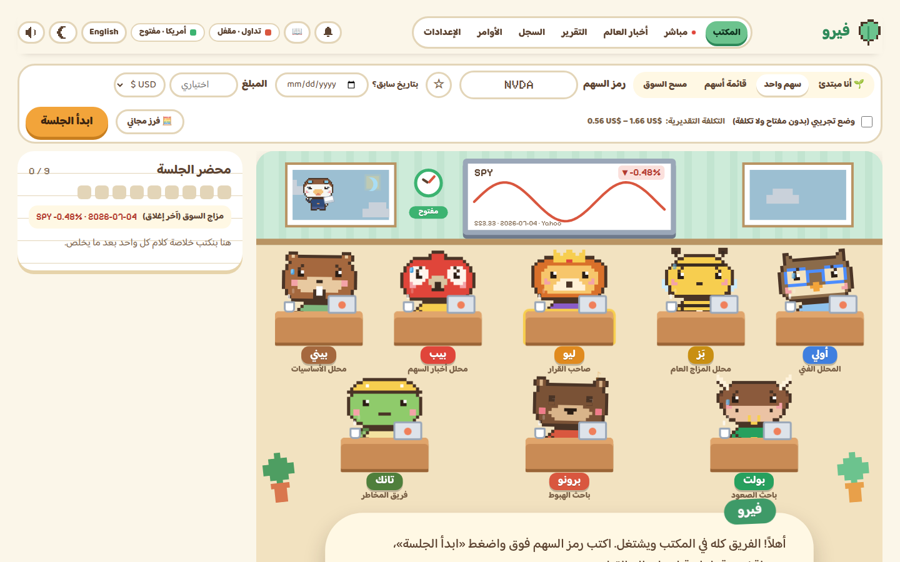 **المكتب:** الفريق على مكاتبه. تختار سهم أمريكي أو سعودي وتبدأ. *The office: pick a US or Saudi stock and start.* | 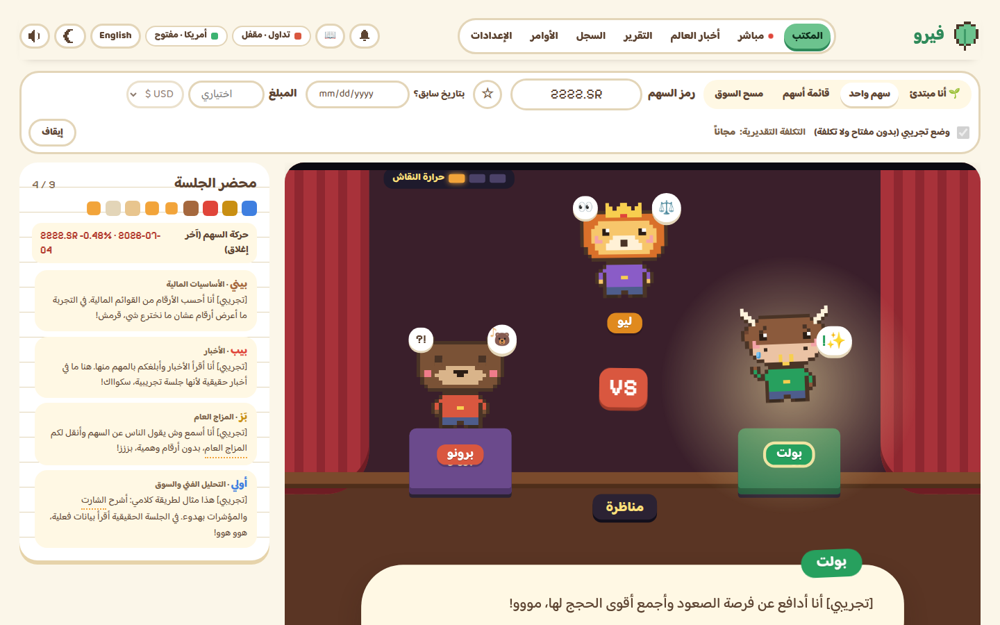 **المناظرة:** بولت (الصاعد) ضد برونو (الهابط)، وليو يدير النقاش. *The bull-vs-bear debate, moderated by Leo.* |
| 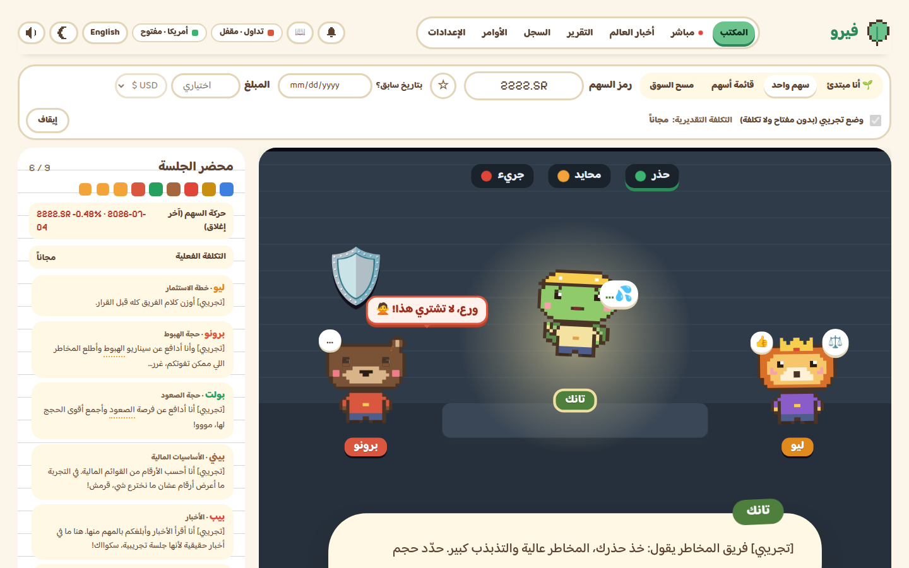 **غرفة المخاطر:** تانك يراجع المخاطرة، وبرونو يحذّر «ورع، لا تشتري هذا!». *The risk room: Tank reviews the risk.* | 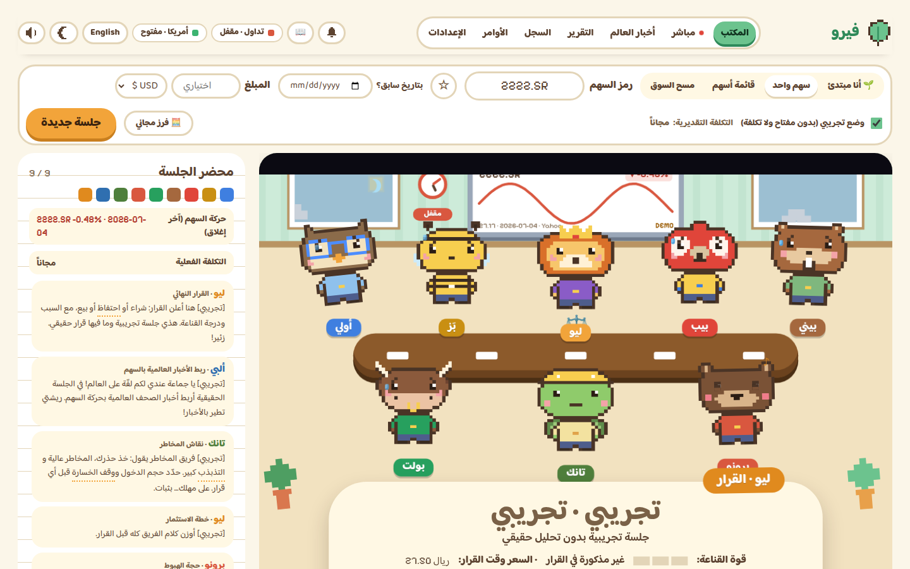 **قاعة القرار:** ليو يعلن القرار مع السبب والسعر وقت القرار. *The boardroom: Leo's call, reason and price.* |
| 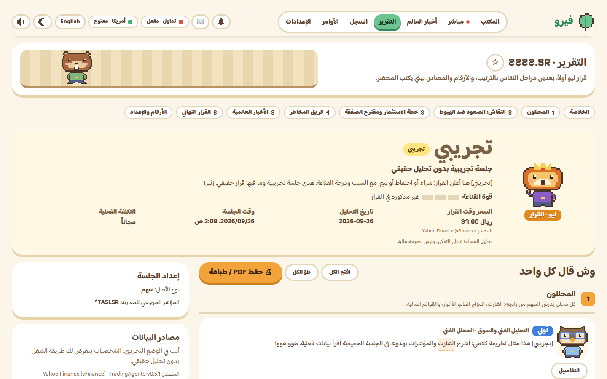 **التقرير:** كل مرحلة بالترتيب، مع الأرقام والمصادر. *The report: every step in order, with figures and sources.* | 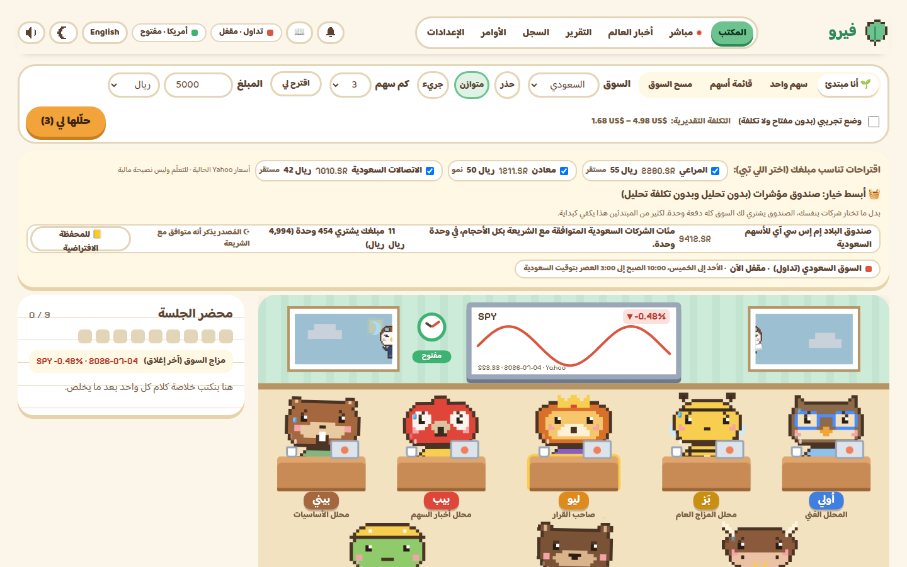 **وضع المبتدئ:** اكتب مبلغك (مثلاً 5000 ريال)، واحصل على شركات تناسبه وخيار صندوق مؤشرات. *Beginner mode: suggestions that fit your amount, plus an index-fund option.* |
| 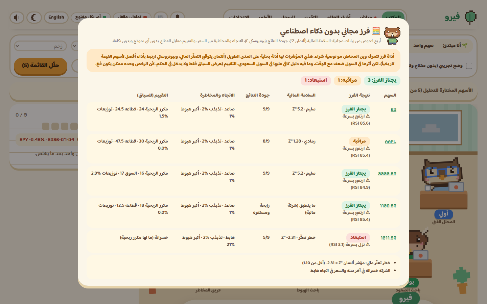 **الفرز المجاني بدون ذكاء اصطناعي:** السلامة المالية وجودة النتائج والاتجاه لأسهم أمريكية وسعودية معاً. *Free screen without AI, US and Saudi stocks together.* | 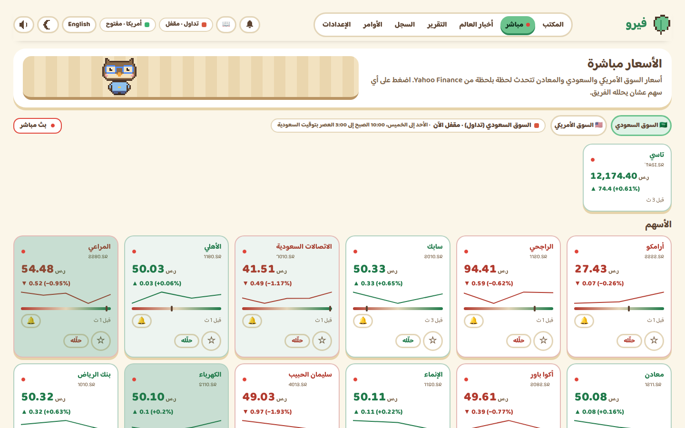 **الأسعار مباشرة: السوق السعودي** (تاسي والأسهم). *Live prices: Saudi market (TASI and stocks).* |
| 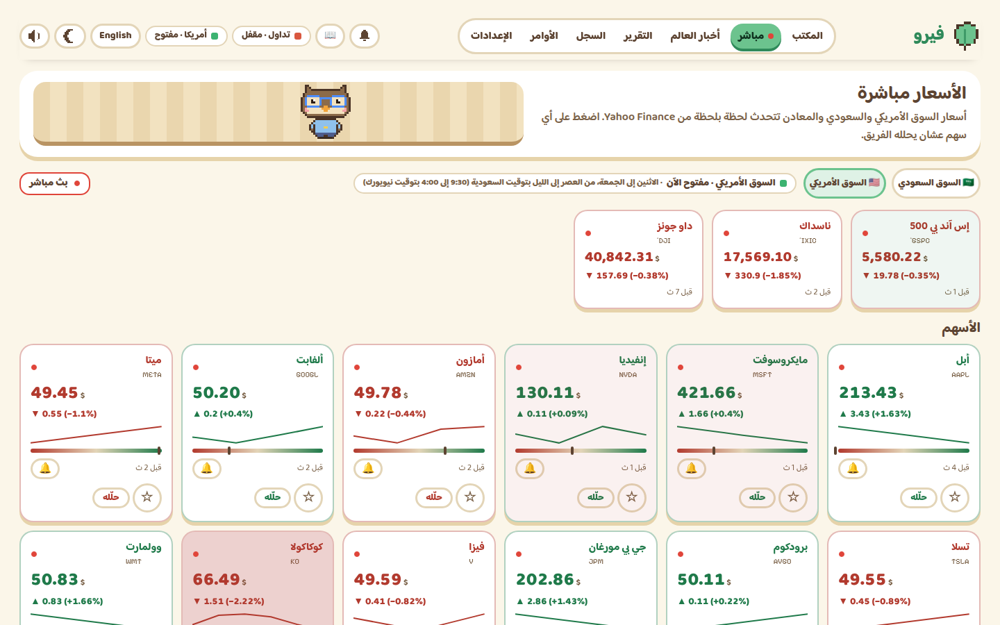 **الأسعار مباشرة: السوق الأمريكي** (S&P 500 وناسداك وداو جونز). *Live prices: US market.* | 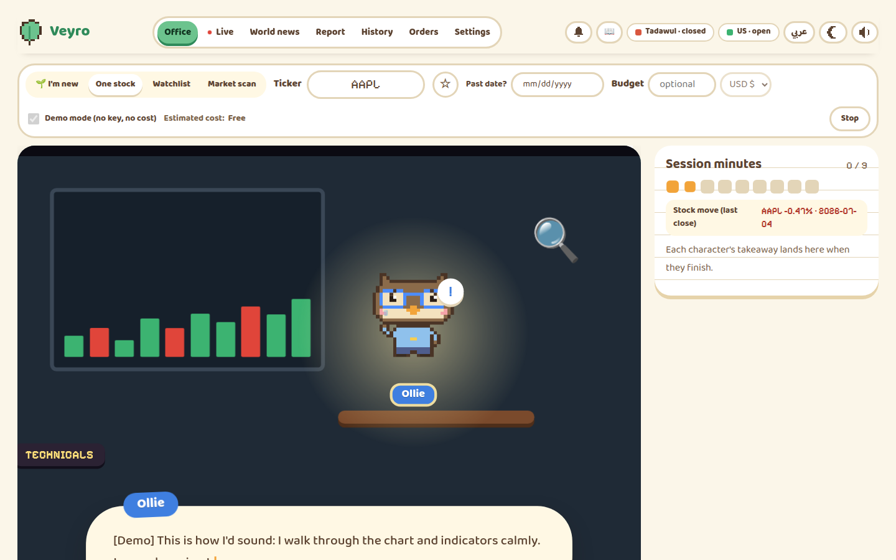 **بالإنجليزي:** أولي يشرح الشارت لسهم Apple. *In English: Ollie reads Apple's chart.* |
| 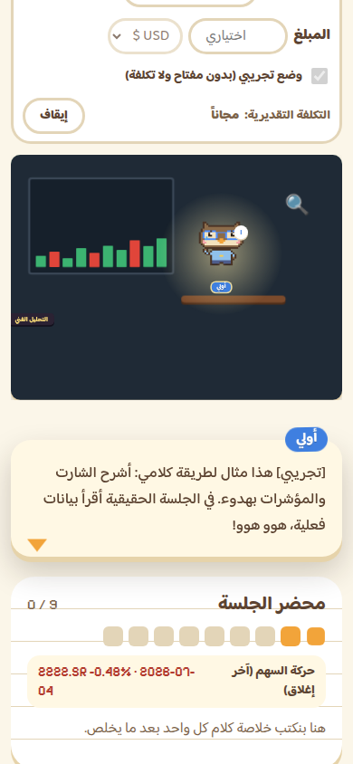 **على الجوال:** الكلام يظهر تحت المسرح بخط واضح. *On a phone: the dialogue shows under the stage.* | |

---

## الطريقة الأسهل: التطبيق
- **الأسرع:** شغّل **`Veyro-Setup.exe`** مرة وحدة (تثبيت للمستخدم الحالي، بدون صلاحيات مدير). بعدها يفتح من سطح المكتب بسرعة. بياناتك في مجلد التطبيقات الخاص بحسابك وتبقى حتى لو حذفت التطبيق.
- أو مجلد **`Veyro`** واضغط **`Veyro.exe`** (سريع أيضاً، وبياناتك في **`Veyro-Data`** جنبه).
- **`Veyro-Portable.exe`** ملف واحد بدون تثبيت، لكنه أبطأ في الفتح لأنه يفك نفسه كل مرة.
- المفاتيح دائماً في خزنة ويندوز.
- إذا سكّرت النافذة يبقى فيرو في شريط المهام (جنب الساعة) عشان التنبيهات والتقرير الصباحي. للخروج: زر فيرو في شريط المهام ← خروج.

## التشغيل من المجلد (خطوات بسيطة)

1. تأكد إن عندك **Python 3.11 أو أحدث** (من python.org). أول مرة فقط.
2. افتح مجلد `Veyro` واضغط ضغطتين على **`start.bat`**.
   - أول مرة ياخذ كم دقيقة يجهّز نفسه (يحتاج إنترنت).
3. المتصفح بيفتح تلقائياً على المكتب: `http://127.0.0.1:8765`
4. عشان توقفه: سكّر نافذة **Veyro server** أو اضغط `stop.bat`.

### أول استخدام
- بدون مفتاح؟ فعّل **الوضع التجريبي** وشوف الشخصيات تشتغل (بدون تكلفة وبدون تحليل حقيقي).
- للتحليل الحقيقي: **الإعدادات ← النموذج والمفتاح** ← اختر Claude ← الصق مفتاح API ← حفظ.
  المفتاح يُحفظ في خزنة ويندوز فقط، وما يظهر كامل مرة ثانية.
- اكتب رمز السهم (مثل `NVDA`) واضغط **ابدأ الجلسة**.

### أربع طرق للعمل
- **🌱 أنا مبتدئ**: اكتب المبلغ اللي معك (مثلاً ١٠٠٠ ريال)، اختر السوق (السعودي/الأمريكي/الاثنين) وراحتك مع المخاطرة. الفريق يقترح شركات كبيرة ومعروفة تقدر تشتري منها بمبلغك (بأسعار حقيقية)، يحللها كاملة، وبعدين ليو يقسم المبلغ بأسهم كاملة، وكل شخصية تعطيك نصيحة من خبرتها.
- **سهم واحد**: جلسة كاملة لسهم تختاره. ابحث بالرمز أو **باسم الشركة** (بالعربي أو الإنجليزي، مثل «أرامكو» أو «Apple»).
- **قائمة أسهم**: اختر الأسهم اللي تبيها بالبحث (حتى ٥٠ سهم) أو أضف المفضلة، والفريق يرتبها في النهاية.
- **مسح السوق**: مرشحين حقيقيين من Yahoo Finance (حتى ٢٥)، تختار منهم اللي تبي يتحلل، ثم ترتيب.

### شاشة «مباشر»
- أسعار السوق السعودي أو الأمريكي (تختار بينهم) مع المؤشرات (تاسي، S&P 500، ناسداك، داو)، والمعادن: الذهب والفضة والبلاتين والبلاديوم والنحاس، وسعر جرام الذهب عيار 24 و21 بالريال.
- تتحدث لحظياً من بث Yahoo Finance المباشر، مع وميض أخضر/أحمر عند كل تغيّر، ومسار السعر، ومدى اليوم، ووقت آخر تحديث لكل سعر. إذا البث غير متاح يظهر آخر سعر معروف مع وقته.
- زر «حلّله» يرسل السهم للمكتب، والنجمة تضيفه للمفضلة (والمفضلة تظهر في الشاشة مباشرة).

### توفير التكلفة والمتابعة
- **إعادة استخدام تحليل اليوم:** إذا حللت نفس السهم اليوم بنفس النماذج، فيرو يعرض عليك النتيجة السابقة مجاناً بدل ما تدفع مرة ثانية. وفي القوائم والمسح تنعاد تلقائياً (♻).
- **💰 الوضع الاقتصادي** (قائمة الأسهم ومسح السوق): فحص مجاني من بيانات الأسعار (الاتجاه، عائد 3 شهور، التذبذب)، وبعدها التحليل الكامل المدفوع لأفضل عدد تختاره فقط.
- **📒 المحفظة الافتراضية** (في «السجل»): أضف قرار «شراء» أو خطة ليو كاملة، وتابع العائد مقابل تاسي أو S&P 500 من يوم الإضافة. بدون فلوس حقيقية.
- **🔔 تنبيهات الأسعار** (في «مباشر»): «نبّهني إذا الذهب فوق كذا» أو «إذا أرامكو تحت كذا». توصل للجرس وإشعار ويندوز.
- **🖨 حفظ التقرير PDF** بالعربي أو الإنجليزي: زر في التقرير يفتح كل الأقسام ويطبعها (اختر «حفظ كـ PDF»).
- **مصدر البيانات:** Yahoo Finance (الافتراضي)، أو Stooq (مجاني)، أو Alpha Vantage (بمفتاحك) من الإعدادات المتقدمة. أي شي ما يغطيه المصدر المختار يجي من Yahoo.

### الثقة والتحكم في التكلفة والتعلّم
- **لوحة الثقة** (في «السجل»): كل قرار حقيقي منتهي ينحسب مقابل مؤشر سوقه: نسبة الإصابة، ومتوسط التفوّق، وحسب القرار، وحسب النموذج مع تكلفة الجلسة، ونسبة الإصابة شهرياً، مع تنبيه إذا العينة صغيرة (أقل من 10 قرارات).
- **سقف ميزانية شهري** (الإعدادات ← النموذج والمفتاح): تكتب مثلاً 20 دولار. بعدها يظهر عدّاد صرف الشهر في شريط البداية، ويطلع تنبيه قبل تحليل ممكن يتجاوز السقف، ولما يوصل الصرف للسقف ما تبدأ جلسات مدفوعة جديدة (والمسح يوقف). الوضع التجريبي يبقى متاح. المزوّدات اللي سعرها غير معروف ما تنحسب، ويظهر هذا.
- **📖 قاموس المصطلحات**: أي مصطلح مالي في التقارير والمحضر ودليل المبتدئ تحته خط منقّط؛ اضغطه ويطلع شرح بسيط. وزر 📖 فوق يفتح القاموس كامل مع بحث.

### بيانات مجانية بدون اشتراكات
- Yahoo Finance أساسي، وإذا ما رد على سهم أمريكي أو مؤشر أو معدن أو عملة يجي السعر تلقائياً من Stooq (مجاني).
- إذا ما توفر تاريخ مؤشر تاسي من Yahoo، القرارات السعودية تنقاس مقابل صندوق MSCI السعودية (KSA)، وتاريخه كامل ومجاني. الريال مربوط بالدولار فحركته قريبة من السوق السعودي، والجلسة تسجّل أي مؤشر استخدمت.

### المبلغ (اختياري)
- اكتب المبلغ اللي تبي تستثمره (دولار أو ريال) في شريط البداية.
- مسح السوق يقترح فقط أسهم يكفي مبلغك لسهم واحد منها على الأقل.
- مدير المحفظة في الإطار (ليو) يعرف المبلغ المتاح وقت القرار.
- بعد التحليل تطلع **خطة ليو للمبلغ**: كم سهم من كل شركة قرارها «شراء» أو «زيادة»، وكم يبقى نقد. مثال للتفكير وليس نصيحة مالية.

### 🧮 فرز مجاني بدون ذكاء اصطناعي
زر **«فرز مجاني»** جنب «ابدأ» (لسهم واحد أو قائمة أسهم أو مرشحي المسح). يفحص كل سهم من بيانات مجانية وبدون أي تكلفة:
- **السلامة المالية:** مؤشر ألتمان Z'' (خطر التعثّر).
- **جودة النتائج:** مؤشر بيوتروسكي F، وهو 9 بنود من آخر سنتين.
- **الاتجاه والمخاطرة:** من السعر.
- **التقييم مقابل القطاع:** يُعرض للسياق فقط.

النتيجة **فرز مو توصية**: «يجتاز الفرز» أو «مراقبة» أو «استبعاد» أو «بيانات ناقصة»، مع السبب. تقدر تضغط «حلّل المجتازين فقط» علشان الفريق يحلل الأسهم اللي اجتازت. وكل نتيجة تنقاس لاحقاً في لوحة الثقة.

### زر الإيقاف
يوقف الجلسة فوراً حتى لو كان أحد الوكلاء في منتصف تفكيره، والجلسة الحقيقية تقدر تكملها لاحقاً من «السجل».

### ألبي، ناقل الأخبار العالمية (صفحة «أخبار العالم»)
- عناوين حقيقية من أقوى الصحف: أرقام، الشرق بلومبرغ، العربية، الاقتصادية، رويترز، الجزيرة (وبالإنجليزي: Bloomberg، Reuters، FT، WSJ، CNBC، The Economist، BBC).
- مؤشرات العالم الآن: السوق الأمريكي، تاسي، أوروبا، آسيا، النفط، الذهب، الدولار، السندات، بيتكوين.
- **ابحث في أخبار الإنترنت** عن أي موضوع، وألبي يرتب المصادر القوية أولاً ويحلّل مع ذكر المصدر.
- **اربط بسهم**: ألبي يربط الأخبار العالمية بحركة السهم. وفي كل جلسة يطير للمكتب قبل قرار ليو ويعطي الفريق الربط العالمي.

### فريق التحليل (من خصائص TradingAgents)
- الإعدادات ← فريق التحليل: اختر من يحضر من المحللين، وعدد جولات النقاش وجولات المخاطر.
- يدعم العملات الرقمية (مثل `BTC-USD`)، وفيها بيني يأخذ استراحة لأنه ما فيه قوائم مالية.
- إذا فعّلت التنفيذ، ليو يعرف محفظتك الحالية وقت القرار.

### المساعد اليومي
- **المفضلة ★**: اضغط النجمة جنب أي سهم، ويظهر في شريط «أسهمي المفضلة» مع حركته اليوم.
- **التنبيهات 🔔**: بيب ينبهك إذا تحرك سهم مفضل بقوة (3٪ افتراضياً)، وألبي إذا نزل خبر كبير عنه. التنبيهات مجانية.
- **التقرير الصباحي**: فعّله من الإعدادات وحدد الوقت، والفريق يحلل مفضلتك كل صباح (يكلف حسب عدد الأسهم).
- **اسأل الفريق**: بعد القرار اكتب سؤالك، والشخصية المسؤولة تجاوب من التحليل نفسه.
- **بطاقة برونو**: في السجل، كم مرة أصاب القرار هذا الشهر.

### مفتاح Claude
- الإعدادات ← الصق المفتاح ← حفظ، وبعدها اضغط **«اختبر الاتصال»**.
- إذا طلع لك إن المفتاح يحتاج **Workspace ID**: افتح console.anthropic.com ← Settings ← Workspaces، وانسخ المعرّف اللي يبدأ بـ `wrkspc_` والصقه في الحقل تحت المفتاح.
- تقدر تختار **أي نموذج Claude** (Fable 5.1، Opus 5.5، Opus 5، Sonnet 5، Haiku 4.5، والأقدم) مع سعره، أو اضغط «حمّل كل النماذج المتاحة لي» لتجيب القائمة من حسابك مباشرة، أو «✎ نموذج آخر» واكتب معرّفه.
- **التوصية**: Sonnet 5 للمحللين والنقاش (أفضل توازن سرعة وجودة وسعر) وOpus 5.5 لقرار ليو. الأرخص: Haiku 4.5. أعلى جودة: Fable 5.1 (أغلى بكثير). زر «استخدم الموصى به» يضبطها بضغطة.
- مزوّدون آخرون يدعمهم الإطار: OpenAI، Gemini، Grok، DeepSeek، Mistral، Qwen، GLM، Kimi، MiniMax، OpenRouter، Groq، وOllama المحلي المجاني. لكل واحد توصية وقائمة نماذج من حسابك.

### اللغة والشكل
- زر **English/عربي** فوق: الواجهة وكلام الشخصيات كله يتحول للغة المختارة.
- زر القمر/الشمس: نهاري أو ليلي.
- الإعدادات: حيوية الحركة، تقليل الحركة، الأصوات، عرض التكلفة.

---

## التنفيذ عبر Alpaca (اختياري، مغلق افتراضياً)

فيرو يعطيك توصيات فقط، إلا إذا فعّلت التنفيذ بنفسك. **كل أمر يحتاج تأكيدك** ولا يوجد تداول تلقائي.

### ١) البدء بالوضع التجريبي (Paper)، ننصح فيه أولاً
1. سجّل في alpaca.markets وافتح **Paper Trading**، وانسخ **Key ID** و **Secret Key** الخاصة بالحساب التجريبي.
2. في فيرو: **الإعدادات ← التنفيذ (اختياري) ← مفاتيح Alpaca التجريبية** ← الصق ← **تحقق واحفظ**.
3. اختر الوضع **تجريبي (Paper)**. تظهر شارة **PAPER** فوق.
   - بدون مفاتيح Paper: يشتغل **محاكاة (MOCK)** داخل التطبيق للتدريب فقط، وما يلمس Alpaca.
4. راجع **حدود المخاطرة** واحفظها (الافتراضي: ٥٠٠$ للأمر، ١٠٠٠$ للسهم، ٢٠٠$ خسارة يومية، ٥ أوامر يومياً).
5. بعد قرار ليو (شراء/بيع) اضغط **ليو يقترح أمر**. تانك يفحص الحدود، وبعدها أنت تضغط **أؤكد الأمر**.
6. شاشة **الأوامر**: الأوامر المفتوحة، التنفيذات، المحفظة، سجل التدقيق وتصدير CSV، و**زر الطوارئ**.

### ٢) الوضع الحقيقي (Live)، فلوس حقيقية
1. احفظ **مفاتيح Alpaca الحقيقية** في الإعدادات (منفصلة عن التجريبية، وما تُقرأ من ملف `.env` أبداً).
2. احفظ **حدود المخاطرة للوضع الحقيقي**.
3. اضغط **حقيقي (Live)** واكتب العبارة بالضبط: **«أفهم أن هذا مال حقيقي»**.
4. تظهر شارة **LIVE** حمراء في كل الشاشات. للرجوع: ضغطة وحدة على **تجريبي** أو **مغلق**، والوضع الحقيقي يتقفل من جديد.

**زر الطوارئ** يلغي كل الأوامر المفتوحة ويوقف التنفيذ فوراً. **بيع كل المراكز** إجراء منفصل يحتاج كتابة عبارة تأكيد.
المسموح فقط: أسهم أمريكية، أوامر سوق أو محددة السعر، نقد فقط (لا هامش، لا بيع على المكشوف، لا خيارات، لا عملات رقمية).

---

## English (short)

1. Install Python 3.11+ and double-click **`start.bat`**. The browser opens `http://127.0.0.1:8765`.
2. Try **Demo mode**, or add your API key in **Settings** (stored in Windows Credential Manager).
3. Type a ticker **or a company name** (Arabic or English) and press **Start session**. Other modes: **🌱 I'm new** (enter your amount, e.g. 1000 SAR: the team picks affordable well-known companies, analyses them and Leo splits the amount into whole shares, with a tip from every character), a **Watchlist** (pick up to 50 stocks), or a **Market scan** (up to 25 real candidates, tick the ones to analyse).
   - Optional **budget**: the Portfolio Manager knows your free cash, scans only suggest affordable stocks, and Leo lists exactly which stocks to buy, how many shares and why.
   - **🧮 Free screen** (no AI, no cost): Altman Z'' financial health, Piotroski F-score quality, price trend and risk, and valuation against the sector, giving a screening verdict with reasons (pass / watch / exclude / not enough data). A filter, not a recommendation. "Analyse only those that passed" hands them to the team.
   - **Stop** ends a session immediately; a real session can be resumed from History.
   - The office plays like a short film: every step has its own set (chart room, news studio, debate arena, Leo's office, risk room, newsroom, boardroom).
   - Settings: any Claude model (or any provider the framework supports) with a recommended pair and a live list from your account; text size, high contrast and read-aloud.
4. Optional **execution (Alpaca)**: Off by default. Paper keys give Paper (without keys, a labelled in-app Mock). Live needs live keys, Live limits and the typed phrase. Every order needs your confirmation, and limits are enforced on the server.

## For developers
- Desktop app: `python tools/build_desktop.py` (bundles Python + packages into `desktop/runtime`, precompiled with unchecked-hash `.pyc` so no launch recompiles anything), then `npm run dist` in `desktop/` gives `desktop/dist/Veyro-Setup.exe` (recommended, fastest launches) and `desktop/dist/win-unpacked/`. `npm run dist:portable` also builds `Veyro-Portable.exe`.
- Backend: `backend/` (FastAPI). Run `.venv\Scripts\python -m veyro` from `backend/`.
- Frontend: `frontend/` (Vite + React + TS). Run `npm run dev` (proxies to 8765) and `npm run build` to update `frontend/dist`. To use the Orders screen from the dev server, start the backend with `VEYRO_DEV=1` (its origin is refused otherwise).
- Tests: `.venv\Scripts\python -m pytest backend/tests -q`, and the browser suites `bash tools/e2e/run_all.sh` (see `tools/e2e/README.md`). CI runs both on every pull request.
- How to contribute: [`CONTRIBUTING.md`](CONTRIBUTING.md). How the pieces fit: [`docs/ARCHITECTURE.md`](docs/ARCHITECTURE.md).
- Browser verification: `.venv\Scripts\python tools\verify_app.py` (screenshots go to `verification/`).
- Design canvas generator: `.venv\Scripts\python tools\build_canvas.py <out>`.

Credits: built on [TradingAgents](https://github.com/TauricResearch/TradingAgents) © Tauric Research (Apache-2.0, see `third_party/TradingAgents/LICENSE`), used unmodified. Fonts: Baloo Bhaijaan 2 and Pixelify Sans (SIL OFL). Characters and art are original.
